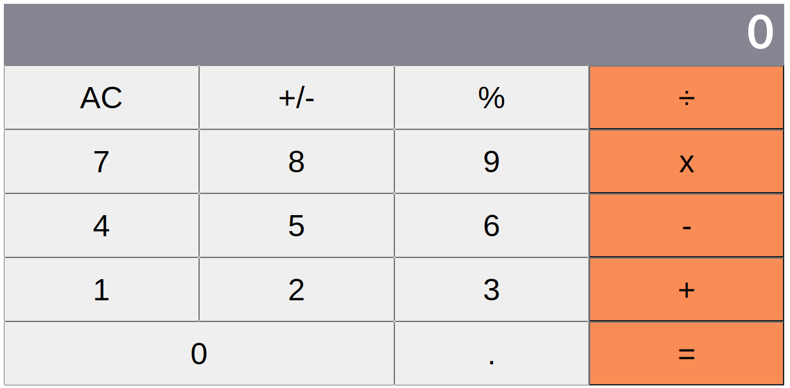

# React Calculator App
This project is a basic react calculator app. Here, I used React components, JSX, React states and props, and event handlers.



## Built With
- CSS
- JavaScript
- React
- Jest 

## Live Demo
[Live Demo](https://vibrant-meitner-dd0695.netlify.app/)

## Getting Started 
To get a local copy up and running, follow these simple example steps.

### Prerequisites

Make sure you have Node.js  running on your local machine.

### Setup

~~~bash
$ git clone https://github.com/Godswilly/react-calculator.git
$ cd react-calculator
~~~

Install modules:

```
yarn install
```

### Usage

Start server with:

```
    yarn start or npm start
```

## Author

👤 **Kalu Agu Kalu**

- [Github](https://github.com/Godswilly)
- [Twitter](https://twitter.com/KaluAguKalu17)
- [Linkedin](https://www.linkedin.com/in/kalu-agu-kalu/)

## 🤝 Contributing

Contributions, issues, and feature requests are welcome!

Feel free to check the [issues page](https://github.com/Godswilly/react-calculator/issues).

## Show your support

Give an ⭐️ , if you like this project!

## Acknowledgments
- [Microverse Inc](https://www.microverse.org/)